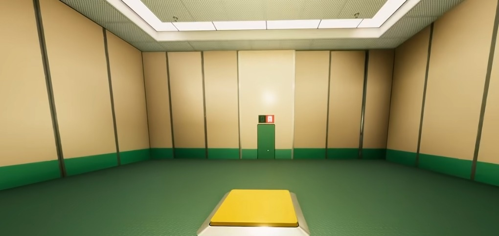

# Especificação da Implementação

> [!CAUTION]
> - Você <ins>**não pode utilizar ferramentas de IA para escrever esta
>   especificação**</ins>

> [!WARNING]
> - Após a entrega da primeira versão completa, esta especificação não
>   poderá ser alterada. A implementação final deverá corresponder ao que
>   estiver descrito neste arquivo.

## Integrantes da dupla

- **Aluno 1 - Nome**: <mark>`Daniel Gutschwager`</mark>
- **Aluno 1 - Cartão UFRGS**: <mark>`00315708`</mark>

- **Aluno 2 - Nome**: <mark>`Leonardo Leites`</mark>
- **Aluno 2 - Cartão UFRGS**: <mark>`00338804`</mark>

## Detalhes do que será implementado

- **Título do trabalho**: <mark>`Infraliminal`</mark>
- **Parágrafo curto descrevendo o que será implementado**: <mark>`Reimplementar uma fase do jogo Superliminal, um jogo de puzzle que usa a percepão de tamanho dos objetos relativo a distância da camera para de fato aumentar ou diminuir o valor real do objeto em cena.`</mark>

## Especificação visual

### Vídeo - Link

> [!IMPORTANT]
> - Coloque aqui um link para um vídeo que mostre a aplicação gráfica
>   de referência que você vai implementar. **Sua implementação deverá
>   ser o mais parecido possível com o que é mostrado no vídeo (mais
>   detalhes abaixo).**
> - **Você não pode escolher como referência: (1) algum trabalho realizado
>   por outros alunos desta disciplina, em semestres anteriores. (2) Minecraft.**
> - Por exemplo, você pode colocar um vídeo de um jogo que você gosta,
>   e seu trabalho final será uma re-implementação do jogo.
> - O vídeo pode ser um link para YouTube, Google Drive, ou arquivo mp4 dentro
>   do próprio repositório. Mas, garanta que qualquer um tenha
>   permissão de acesso ao vídeo através deste link.

<mark>`https://www.youtube.com/watch?v=WrQl0WQRGBo`</mark>

### Vídeo - Timestamp

> [!IMPORTANT]
> - Coloque aqui um **intervalo de ~30 segundos** do vídeo acima, que
>   será a base de comparação para avaliar se o seu trabalho final
>   conseguiu ou não reproduzir a referência.

- **Timestamp inicial**: <mark>`13:30`</mark>
- **Timestamp final**: <mark>`14:30`</mark>

### Imagens

> [!IMPORTANT]
> - Coloque aqui **três imagens** capturadas do vídeo acima, que você
>   irá usar como ilustração para as explicações que vêm abaixo.
> - As imagens devem estar armazenadas neste repositório, no diretório
>   `images/spec/`, com os nomes `image1`, `image2` e `image3`.
> - Cada imagem deve usar o formato `.jpg` ou `.png`. Ajuste a extensão
>   nos vínculos abaixo para que corresponda ao arquivo armazenado.
> - Escolha imagens que correspondam a momentos do intervalo indicado
>   acima ou que sejam relevantes para a comparação com a implementação.

#### Imagem 1

- **Descrição**: <mark>`Print mostrando a composição normal da fase com um objeto e um botão a ser pressionado`</mark>

#### Imagem 2

- **Descrição**: <mark>`Print mostrando a mecânica de segurar um objeto da cena, utilizado para aumentar ou diminuir o objeto.`</mark>

#### Imagem 3

- **Descrição**: <mark>`Print mostrando a Lógica para passar da fase, nessa em especifico um objeto pesado o suficiente precisa estar em cima do botão.`</mark>

## Especificação textual

Para cada um dos requisitos abaixo (detalhados no [Enunciado do Trabalho final - Moodle](https://moodle.ufrgs.br/mod/assign/view.php?id=6302370)), escreva um parágrafo **curto** explicando como este requisito será atendido, apontando itens específicos do vídeo/imagens que você incluiu acima que atendem estes requisitos.

### Malhas poligonais complexas
<mark>`Para as malhas poligonais complexas vamos realizar o escaneamento de objetos pessoais para adicionar a fase. São objetos como peão de xadrez, cubo mágico, dado e um boneco. Os objetos serão filmados, retirados os quadros e por fim os quadros entram no software de fotogrametria para sair a malha. Posteriormente a malha será tratada para ser composta a fase. O vídeo de exemplo mostra alguns objetos como um pedaço de queijo, peças de xadrez e cubos, vamos nos inspirar nisso, mas não nos prendendo a objetos específicos; vamos testar com alguns e os melhores ficarão.`</mark>

### Transformações geométricas controladas pelo usuário
<mark>`Alguns objetos presentes na fase poderão ser controlados pelo usuário, podendo carregar, soltar, rotacionar e controlar o tamanho. O ponto principal é a escala de tamanho que é baseada na distância onde o raio encontra a superfície da cena (jogador controla indiretamente, mirando e andando) e o ângulo de observação. Os controles poderão ser feitos pelo teclado e mouse, como andar usando as teclas WASD e selecionar os objetos usando o mouse.`</mark>

### Diferentes tipos de câmeras
<mark>`Uma câmera em primeira pessoa e uma câmera look-at (em algum objeto)`</mark>

### Instâncias de objetos
<mark>`Na sala podemos ter diversas cópias dos objetos escaneados. A malha é carregada uma única vez e desenhada diversas vezes, cada cópiaa com sua própria matriz.`</mark>

### Testes de intersecção
<mark>`Temos o raio lançado da câmera pelo centro da mira, testado contra os planos das paredes e do chão. O ponto atingido define onde o objeto pousa ao ser solto e sua nova escala. O jogador não poderá atravessar as paredes e os objetos, ou a porta fechada. E também o botão que, quando a peça está em cima, a porta se abre e o jogador pode sair da sala.`</mark>

### Modelos de Iluminação em todos os objetos
<mark>`A fase tem uma luz principal. Paredes, chão, porta e o restante usam um modelo, ja os objetos escaneados já trazem sombreamento da fotogrametria. Por isso teemos que combinar alguns modelos.`</mark>

### Mapeamento de texturas em todos os objetos
<mark>`Os objetos em cena serão na sua grande maioria composições de texturas procedurais, para emular as paredes, o chão e os objetos.`</mark>

### Movimentação com curva Bézier cúbica
<mark>`Na sala podemos adicionar um objeto flutuante, cuja movimentação é definida através de uma curva de Bézier cúbica. Esse objeto será decorativo e não pode ser pego.`</mark>

### Animações baseadas no tempo ($\Delta t$)
<mark>`Utilizaremos uma estrategia de atualização de quadros baseada em tempo, para garantir que a velocidade das animações estejam desacopladas da velocidade de renderização da GPU`</mark>

### Funcionalidade extra obrigatória

> [!IMPORTANT]
> - Descreva a funcionalidade extra relacionada à Computação Gráfica
>   que será implementada.
> - Esta funcionalidade também deverá ser documentada no arquivo
>   `README.md` da entrega final.

<mark>`Teremos a mecânica de pegar um objeto com o mouse (picking), e também sombras`</mark>

## Limitações esperadas

> [!IMPORTANT]
> - Coloque aqui uma lista de detalhes visuais ou de interação que
>   aparecem no vídeo e/ou imagens acima, mas que você **não pretende
>   implementar** ou que você **irá implementar parcialmente**.
> - Para cada item, **explique por que** não será implementado ou por
>   que será implementado parcialmente.

<mark>`Não pretendemos implementar as distorções visuais que aparecem no vídeo, pois não será essencial para a dinâmica geral e precisamos controlar o tempo necessário que seria utilizado para implementar essa função.
Além de também não implementarmos uma fase com o ambiente totalmente dinâmico, ou seja, o ambiente não vai mudar para sugestionar o jogador ou para dar algum efeito na cena (como a parede que desaba no vídeo depois que o jogador passa algum tempo na sala "pensando"), pelo mesmo motivo anterior.
E a fase será uma versão simplificada. No vídeo o jogador é induzido que, ao colocar a peça sobre o botão, terá a sua saída da sala, mas a saída acontece de fato quando ele derruba as paredes com um objeto maior. Na nossa versão, para manter mais simples, vamos fazer apenas com que a porta abra adicionando o objeto em cima do botão e liberando a passagem do jogador.
Os objetos também serão diferentes dos que aparecem no vídeo.`</mark>
